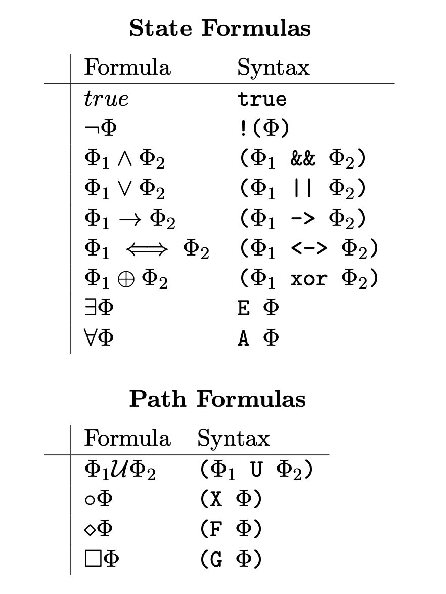
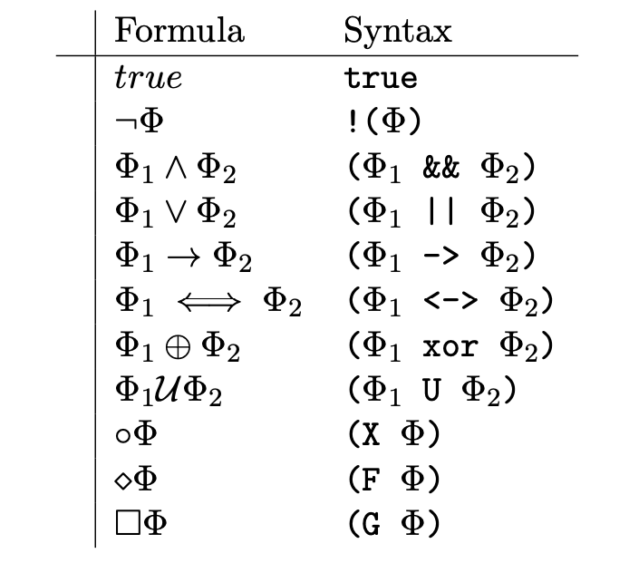

# MiniCheck

A CLI for CTL and bounded LTL model checking

---

# Agenda

- Overview
- Architecture
- Transition Systems
- Formulas
- CLI
- Demo

---

# Overview

- Core
  - Transition systems
  - CTL model checking
- Extension
  - Bounded LTL model checking
- Testing
  - Unit tests for Test-Driven Development
  - 88% coverage
- Bonus
  - Haddock documentation
  - Improved CLI

---

# Architecture

- Cabal project
- Modularized
  - app
    - CLI based on cmdargs
  - lib
    - CTL, LTL, TS, and Utils modules
    - Monadic parsec parsers
  - test
    - hspec unit tests

---

# Transition Systems

- Implicit intrinsic label
- Labels are sequence of letters

## Example

```text
States:
-> pay
- soda
- select
- beer

Transitions:
- pay -> insert_coin -> select
- select -> τ -> soda
- select -> τ -> beer
- soda -> get_soda -> pay
- beer -> get_beer -> pay
```

---
layout: two-cols
---

# CTL Formulas

- Explicit bracketing
- Atomic propositions are sequence of letters

## Examples

- `E (F soda)`
- `A (pay U select)`

::right::



---
layout: two-cols
---

# LTL Formulas

- Explicit bracketing
- Atomic propositions are sequence of letters

## Examples

- `(F (beer || soda))`
- `(pay U select)`

::right::



---

# CLI

- `minicheck` executable
  - `minicheck --help` for usage
- Three modes
  - `minicheck validate TS_FILE`
  - `minicheck ctl TS_FILE CTL_FORMULA`
  - `minicheck ltl TS_FILE LTL_FORMULA BOUND`

---

## layout: center

# Demo
